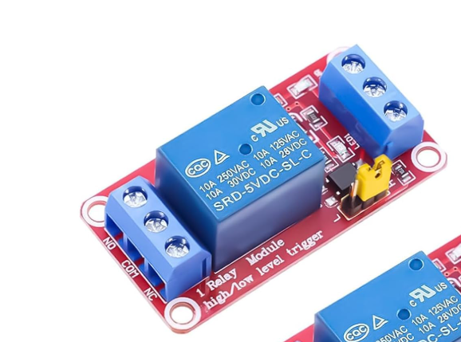

# Arduino HF Radio Morse Keyer

Codigo para Arduino que actua como interfaz Morse entre una computadora y un transceptor HF (probado con Xiegu G90).

## Descripcion

El Arduino recibe caracteres por puerto serie y genera codigo Morse mediante:
- Sonido por buzzer (para monitoreo audible)
- Señal digital que activa un relay para keyear la radio

## Conexiones

```
+----------------------------------------------------------------------+
|                            ARDUINO UNO                               |
|                                                                      |
|   +5V  o------------------------------> Relay VCC                    |
|                                                                      |
|   GND  o--------------------+--------> Relay GND                    |
|         |                    |--------> G90 KEYER -                  |
|         |                    |                                      |
|  Pin 8 o-------[Buzzer]-----+                                      |
|         |           (+)                                                   |
|         |           (-)                                                   |
|         |                                                                 |
|  Pin 10 o------------------------> Relay IN1                            |
|         |                                                                 |
|  Pin 3  o---[CQ Button]--- GND    (INPUT_PULLUP, no resistor needed)  |
|                                                                      |
+----------------------------------------------------------------------+
            |                  |                    |
            v                  v                    v
+----------------------------------------------------------------------+
|                           RELAY MODULE                               |
|                                                                      |
|  VCC o<--------------------- Arduino +5V                              |
|                                                                      |
|  GND o<--------------------- Arduino GND                              |
|                                                                      |
|  IN1 o<--------------------- Arduino Pin 10                          |
|                                                                      |
|  NO  o----------------------------------------------------> G90 KEYER +
|                                                                      |
|  COM o----------------------------------------------------> G90 KEYER -
|                                                                      |
+----------------------------------------------------------------------+
            |                  |
            v                  v
+----------------------------------------------------------------------+
|                            XIEGU G90                                 |
|                                                                      |
|  KEYER + o<-------------------- Relay NO                              |
|                                                                      |
|  KEYER - o<-------------------- Relay COM / Arduino GND              |
|                                                                      |
+----------------------------------------------------------------------+
```

### Modulo Relay 5V (Imagen de referencia)



## Pines

| Pin Arduino | Funcion          | Conexion                |
|-------------|------------------|-------------------------|
| 8           | Buzzer           | Altavoz/Piezo           |
| 10          | Relay Keying     | IN1 del modulo relay    |
| 3           | Boton CQ         | Boton a GND (INPUT_PULLUP) |
| GND         | Tierra           | GND relay y radio       |

## Uso

1. Cargar el codigo en el Arduino
2. Abrir el monitor serie (9600 baudios)
3. Escribir texto y enviar - el Arduino genera Morse automaticamente
4. Presionar el boton en pin 3 para enviar CQ automatico (CQ CQ CQ EA4HUK...)
5. Enviar `!` por serie tambien dispara CQ

## Timing

- Punto (dot): 1x unidad de tiempo
- Raya (dash): 3x unidad de tiempo
- Espacio entre elementos: 1x unidad
- Espacio entre letras: 3x unidad
- Espacio entre palabras: 7x unidad

La variable `timeUnit` (default 60ms) controla la velocidad. Ajustar segun necesidad:
- 50ms = ~24 WPM
- 60ms = ~20 WPM
- 100ms = ~12 WPM

## Caracteres Soportados

- Letras A-Z
- Numeros 0-9
- Espacio (pausa entre palabras)
- `!` dispara secuencia CQ automatica

## Autor

dac - dcialdella@gmail.com - EA4HUK
